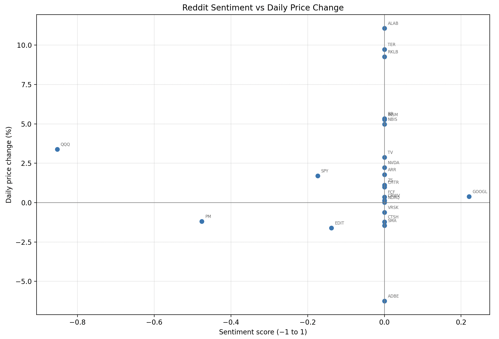

# Sentiment-Stock Analysis

Scrapes financial subreddits for stock ticker mentions, classifies the sentiment of each post using **FinBERT** (a finance-tuned BERT model from Hugging Face), and plots aggregated sentiment against each stock's daily price move — with clickable points linking to Yahoo Finance.



In the image above, QQQ had the strongest negative sentiment in this specific run. However, the stock price was up. This may be due to a skewed view on reddit. Given a larger information pool, sentiment may have differed.

## How it works

1. **Scrape** — pulls hot posts from seven financial subreddits (r/Stocks, r/WallStreetBets, r/Investing and others) via the Reddit API (PRAW) and extracts ticker mentions with regex, filtered through a blocklist of common false positives (CEO, YOLO, USD...).
2. **Score** — each post is classified by FinBERT as positive / negative / neutral; scores are aggregated per ticker, and tickers with fewer than 2 mentions are dropped so a single post can't define a stock's sentiment.
3. **Store** — every post–ticker mention is saved to SQLite with a `UNIQUE(post_id, ticker)` constraint, so re-running the pipeline never double-counts a post that's still in hot. This builds a sentiment history over time.
4. **Price** — closing prices are batch-downloaded with yfinance and converted to daily % change; tickers yfinance can't resolve are dropped.
5. **Plot** — interactive matplotlib scatter of sentiment vs daily price change. Click any point (or use the search box) to open that stock's Yahoo Finance page.

## Setup

```bash
python -m venv .venv
source .venv/bin/activate
pip install -r requirements.txt
```

Copy `.env.example` to `.env` and add your Reddit API credentials
(create an app at https://www.reddit.com/prefs/apps):

```
ID=<your_reddit_client_id>
SECRET=<your_reddit_client_secret>
USER_AGENT=<your_reddit_user_agent>
```

## Run

```bash
python main.py
```

Outputs `quotes.csv` (a record of the run) and opens the interactive plot.
`python plotting.py` re-plots the latest CSV without re-scraping.

## File structure

```
.
├── main.py           # Pipeline entry point: scrape → score → price → plot
├── web_scraper.py    # Reddit scraping and ticker extraction
├── sentiment.py      # FinBERT sentiment classification
├── storage.py        # SQLite persistence with cross-run deduplication
├── data_plot.py       # Interactive scatter plot
├── requirements.txt
├── .env.example      # API key template
└── .gitignore        # Ignores .env, .venv, sentiment.db, quotes.csv
```

## What I learnt

A key aspect in this project was the reddit API. Initially, it was difficult finding the correct website, as api calls were slightly obfuscated by a new system. But once the correct resources were found, the documentation was shockingly simple to understand. 

Another thing I learnt was FinBERT. This was a lot more precise than my previous usage of VADER, as FinBERT is trained on financial language, whereas VADER is not. However, this was not an easy process. One major issue I encountered was deciding how many mentions would make a ticker worth considering.

I also picked up on SQLite through this project. UNIQUE was used to say that the combination must be unique. Essentially, a post with some id "B" + AAPL can only appear once, but a post with some id "C" + AAPL can also appear. Another ticker could also have the same ID, for example "B" + TSLA. This system makes it so each pairing is unique, so it cannot be counted twice.

## Known limitations / future work

- **Post-level sentiment is attributed to every ticker in a post** — a thread mentioning ten tickers gives all ten the same score. Sentence-level attribution would fix this.
- **Scoring uses FinBERT's argmax label**, so confidently-neutral and barely-neutral posts both score 0. Using the full probability distribution (`P(positive) − P(negative)`) would give a continuous score and spread the data out.
- **Sentiment history isn't visualised yet** — the SQLite store accumulates per-ticker time series that could be plotted as trends.
- Hover tooltips with mention counts and example post titles.